# Mermaid 記法について

---

### 参考リンク

<!-- [参考タイトル](参考リンク) -->

- [チートシート](https://jojozhuang.github.io/tutorial/mermaid-cheat-sheet/)
- [mermaid.js の記法を覚えて、楽しく図を描く。](https://qiita.com/t_o_d/items/ac5b04419252f768a535)

---

### 目次

<!-- - [ページ内タイトル](#ページ内リンク) -->

- [基本的な記法について](#基本的な記法について)
- [図の種類](#図の種類)
- [ノードの記法](#ノードの記法)
- [リレーションの記法](#リレーションの記法)
- [サブグラフの作成](#サブグラフの作成)
- [スタイル・アクション](#スタイルアクション)
- [シーケンス図の作成](#シーケンス図の作成)

---

### 基本的な記法について

- コードブロックを表す` 「```」 `の後に`mermaid` とつけることで
  マーメイド記法を利用することができる


- コメントは`%%`の後に記載

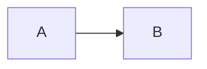

<br>[【目次へ】](#目次)

---

### 図の種類

| コード | 種類       | 表示                     |
| ------ | ---------- | ------------------------ |
| TB     | TOP→BOTTOM | mermaid graph TB; A-->B; |

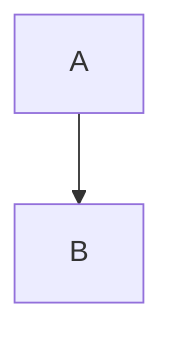

| コード | 種類       | 表示                     |
| ------ | ---------- | ------------------------ |
| TD     | TOP→BOTTOM | mermaid graph TD; A-->B; |


| コード | 種類       | 表示                     |
| ------ | ---------- | ------------------------ |
| BT     | BOTTOM→TOP | mermaid graph BT; A-->B; |

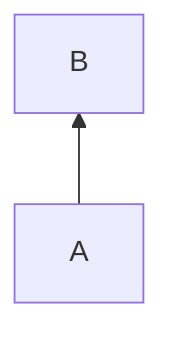

| コード | 種類       | 表示                     |
| ------ | ---------- | ------------------------ |
| RL     | RIGHT→LEFT | mermaid graph RL; A-->B; |

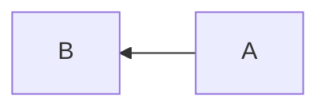

| コード | 種類       | 表示                     |
| ------ | ---------- | ------------------------ |
| LR     | LEFT→RIGHT | mermaid graph LR; A-->B; |


<br>[【目次へ】](#目次)

---

### ノードの記法

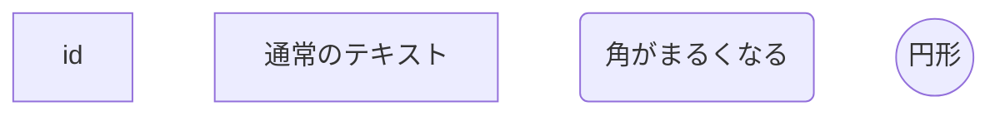

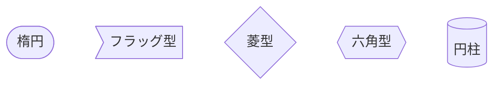

<br>[【目次へ】](#目次)

---

### リレーションの記法

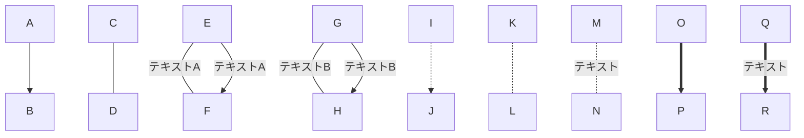

<br>[【目次へ】](#目次)

---

### サブグラフの作成

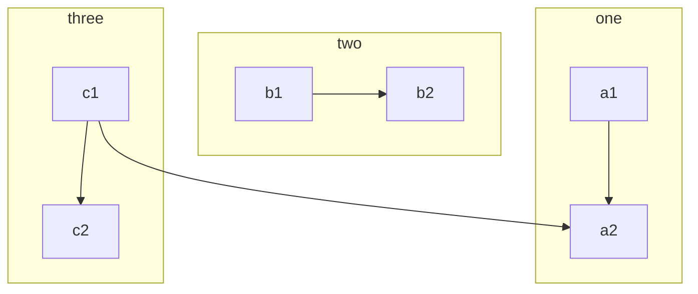

<br>[【目次へ】](#目次)

---

### シーケンス図の作成

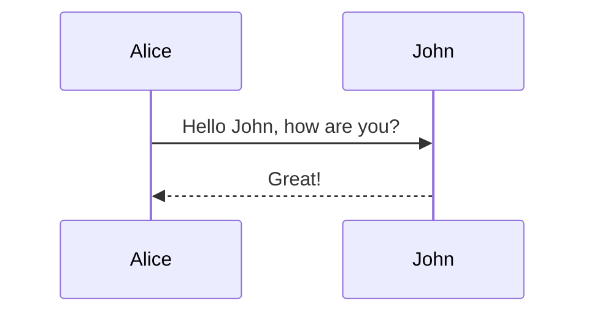

- **アクターの出現順序を指定して、参加者を別の順序で表示できる。**

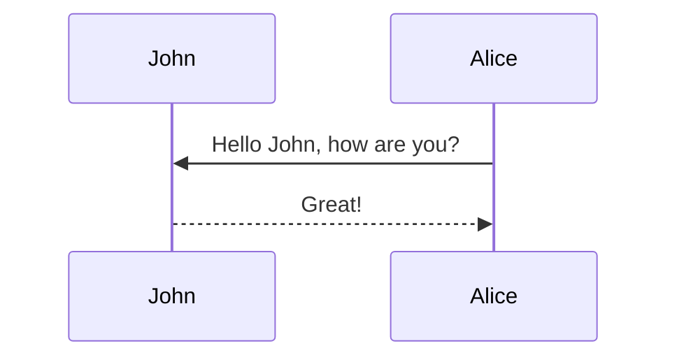

- **エイリアスの作成**


#### テキスト

- 右側

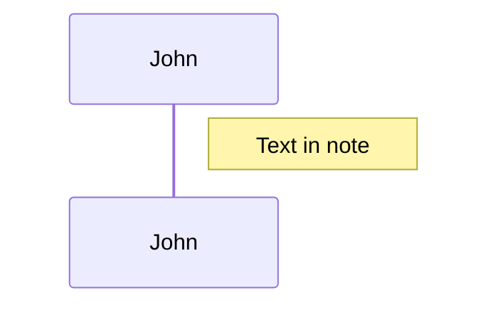

- 左側

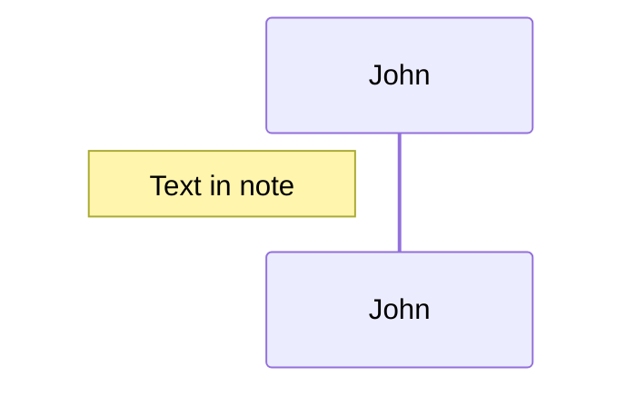

- 横断

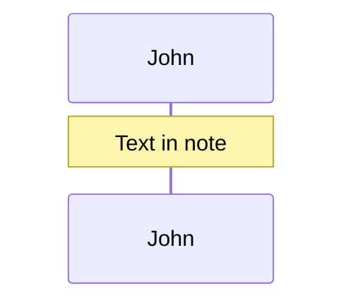

<br>[【目次へ】](#目次)

---

### スタイル・アクション

- **クリックでのイベント**

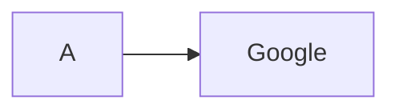

- **スタイルの変更**

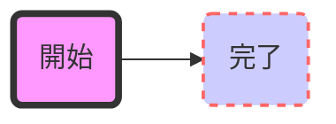

<br>[【目次へ】](#目次)

---

### ガントチャート

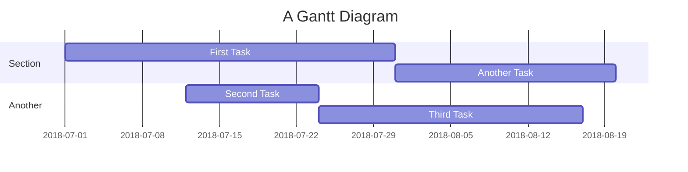

```mermaid
gantt
    dateFormat  YYYY-MM-DD
       title Adding GANTT diagram functionality to mermaid

       section A section
       Completed task            :done,    des1, 2018-01-06,2018-01-08
       Active task               :active,  des2, 2018-01-09, 3d
       Future task               :         des3, after des2, 5d
       Future task2              :         des4, after des3, 5d

       section Critical tasks
       Completed task in the critical line :crit, done, 2018-01-06,24h
       Implement parser and jison          :crit, done, after des1, 2d
       Create tests for parser             :crit, active, 3d
       Future task in critical line        :crit, 5d
       Create tests for renderer           :2d
       Add to mermaid                      :1d

       section Documentation
       Describe gantt syntax               :active, a1, after des1, 3d
       Add gantt diagram to demo page      :after a1  , 20h
       Add another diagram to demo page    :doc1, after a1  , 48h

       section Last section
       Describe gantt syntax               :after doc1, 3d
       Add gantt diagram to demo page      :20h
       Add another diagram to demo page    :48h
```

<br>[【目次へ】](#目次)

---
